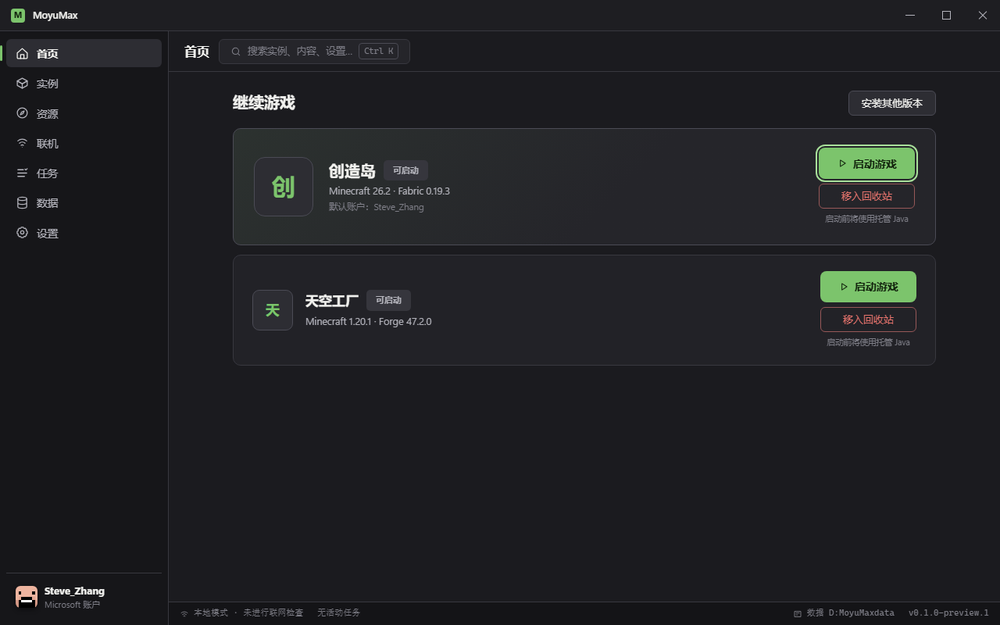
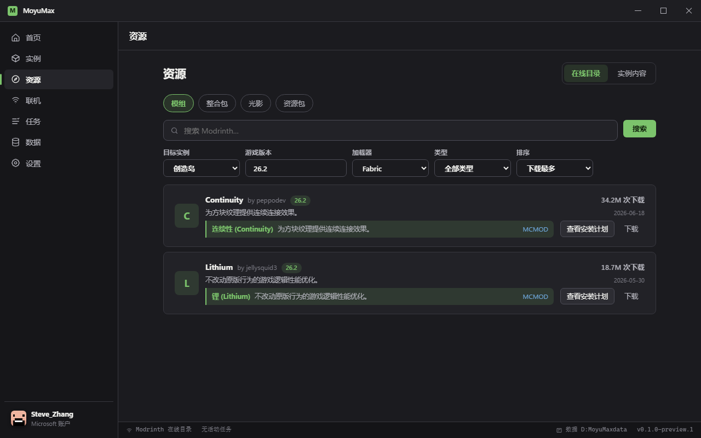

<div align="center">

# MoyuMax

**离线优先、实例隔离、可恢复的 Minecraft: Java Edition 启动器**

[](https://github.com/SakuraRed/MoyuMax/actions/workflows/ci.yml)
[](LICENSE)
[](#下载)
[](#下载)

简体中文 · [核心设计原则](#设计原则) · [功能特性](#功能特性) · [下载](#下载) · [开发](#开发)



</div>

MoyuMax 是一款开源、免费的 Minecraft 启动器，面向 Windows 10 22H2+ x64。
你不需要理解 Java、加载器、依赖树或启动参数：选择版本即可开始，其余交给 MoyuMax。
默认离线、默认实例隔离、默认不上报任何数据。

## 功能特性

**游戏与实例**

- 原版、Fabric、Quilt、Forge、NeoForge 安装与启动，托管 Azul Zulu Java 自动匹配
- 实例完全隔离，回收站可恢复删除，游戏前后自动原子备份，运行期间增量备份
- 世界存档导入导出与恢复点回滚，截图管理，崩溃诊断（本地脱敏 ZIP 导出）

**内容与下载**

- Modrinth 在线目录：热门推荐、搜索、版本/加载器/类型筛选、MCMOD 中文条目
- 模组依赖闭包原子安装与按实例更新；Modrinth/CurseForge 整合包导入、安装与更新
- 模组自由下载：选择版本、自定义文件名与保存路径，不绑定实例
- 多线程分段下载、续传校验、镜像优先来源策略、全局令牌桶限速

**联机**

- EasyTier 联机房间：房间号 + 密码一键组网，无需公网 IP、无需安装驱动
- NAT 类型检测，如实标注简化结论

**账户与体验**

- Microsoft 设备码登录（Mojang 允许名单已通过）、离线账户、Authlib Injector（LittleSkin）
- 皮肤双层头像、启动身份实时展示、简/繁/英三语、深色/浅色/高对比主题、自定义背景与主题包
- 托盘常驻快速唤醒、任务中心（暂停/恢复/优先级/限速）、内置 CLI（开发者模式）



## 设计原则

1. **零门槛**：默认路径直接可用，不把环境决策推给普通用户。
2. **安全默认**：实例隔离、自动更新关闭、危险网络能力默认关闭、遥测不存在。
3. **可恢复**：安装、更新、删除、备份写入全部事务化，可回滚、中断后收敛。
4. **诚实呈现**：能力边界如实标注，不做功能假象；诊断默认不上报。

## 下载

预览版安装包（x64 NSIS，每用户安装，无需管理员）：

- **[MoyuMax_0.1.0_x64-setup.exe](https://github.com/SakuraRed/MoyuMax/releases/latest)**
- 当前为自签名开发证书，安装时 Windows 提示「未知发布者」属预期；正式发行将附带商业 Authenticode 签名
- 每个构建附带 [SBOM](docs/SBOM.json) 与[第三方许可清单](docs/THIRD-PARTY-LICENSES.md)

> 预览版提示：Microsoft 登录已可用；统一通行证、视频背景、卸载分类向导将在后续预览补齐。

## 技术栈

- **Rust**：离线领域核心（SQLite 事务、安装执行、账户、联机、备份），桌面层仅做生命周期与命令适配
- **Tauri 2**：Windows 桌面生命周期、托盘、系统集成
- **Svelte 5 + TypeScript**：声明式 WebView 界面
- **BDD/TDD**:`features/` 行为定义，Rust BDD + Vitest + Playwright 三层验收，GitHub Actions 全量执行

## 开发

要求：Rust 1.96.0、Node.js 22、pnpm 10.26.2、Windows WebView2。

```powershell
corepack pnpm install --frozen-lockfile
cargo test --workspace
corepack pnpm --filter @moyumax/desktop test
corepack pnpm --filter @moyumax/desktop test:e2e
corepack pnpm --filter @moyumax/desktop tauri dev
```

验证门（与 CI 一致）:

```powershell
cargo fmt --all -- --check
cargo clippy --workspace --all-targets --all-features -- -D warnings
corepack pnpm --filter @moyumax/desktop lint
```

## 文档

- [SBOM.json](docs/SBOM.json)（`node scripts/generate-sbom.mjs` 可复现生成）
- [第三方许可声明](docs/THIRD-PARTY-LICENSES.md)

## 许可

客户端以 [GPL-3.0-only](LICENSE) 发布。
EasyTier（[EasyTier/EasyTier](https://github.com/EasyTier/EasyTier)）与 wintun（[WireGuard](https://www.wintun.net/)）作为外部组件按各自许可随附调用，详见第三方许可清单。
